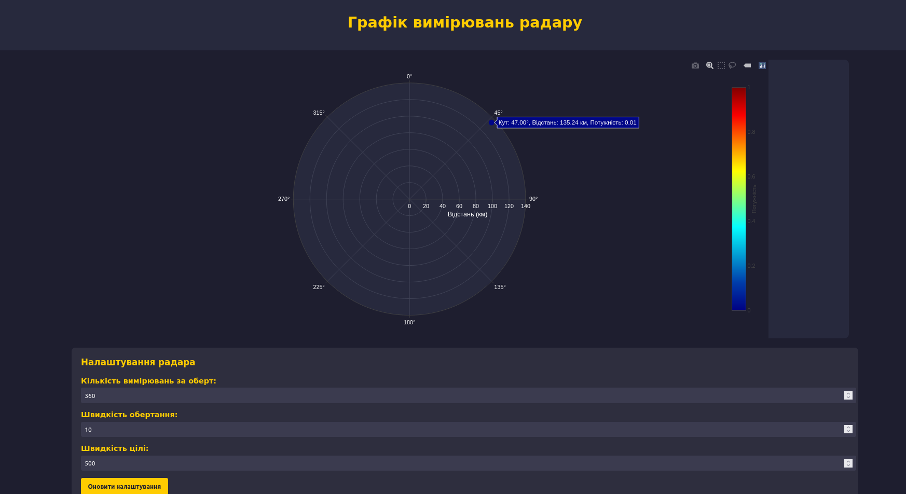

# lab_4

Основні функції сторінки:

1. Відображення радарних даних: На сторінці є графік, який оновлюється в режимі реального часу. Він показує відстань до цілі та її потужність на полярному графіку.

2. Отримання даних через WebSocket: Сторінка встановлює з'єднання з WebSocket-сервером (ws://localhost:4000) для отримання даних радару. При отриманні нових даних вони обробляються і відображаються на графіку.

3. Форма налаштувань: Є форма, яка дозволяє користувачу змінювати налаштування радару, такі як кількість вимірювань за оберт, швидкість обертання та швидкість цілі.

4. Оновлення конфігурації радару: При натисканні кнопки "Оновити налаштування" дані з форми відправляються на сервер через HTTP-запит (PUT на http://localhost:4000/config) для оновлення параметрів радару.
